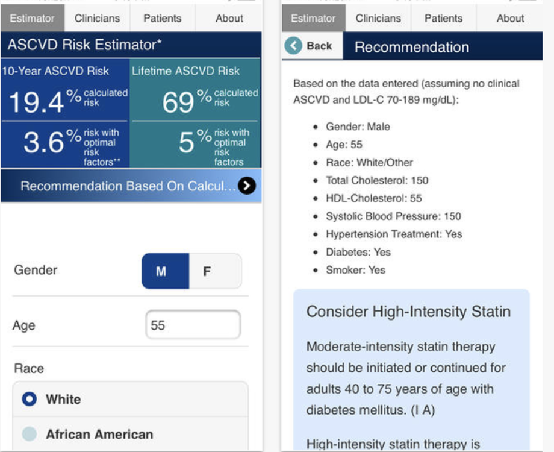
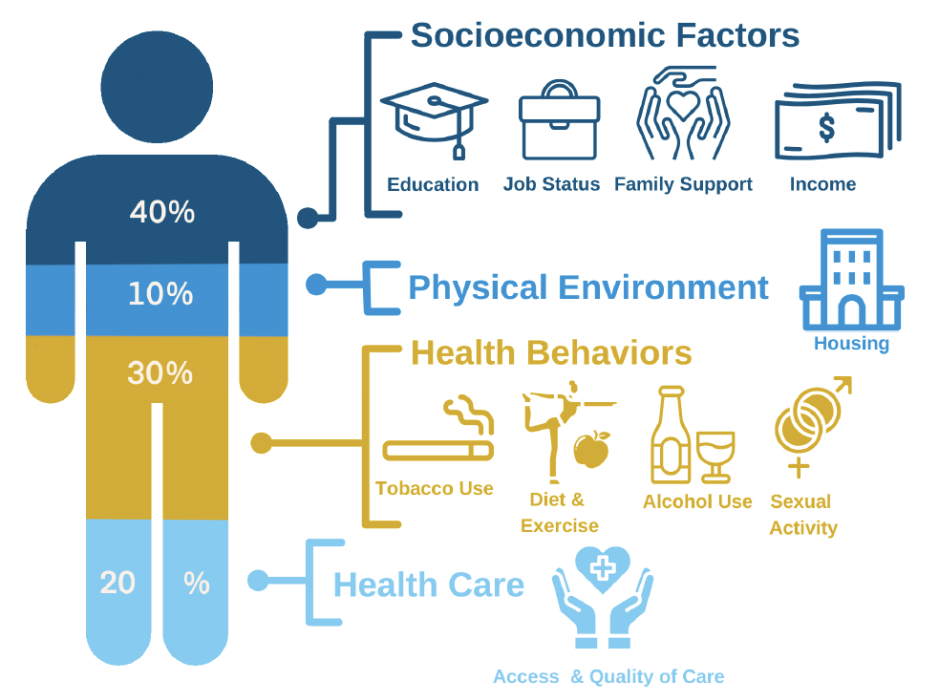
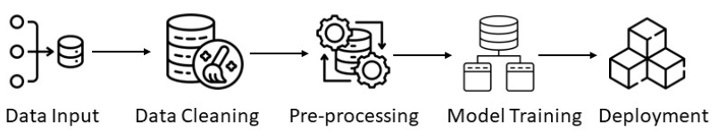

# Improving Risk Scores for Cardiovascular Health using Social Determinants of Health and Machine Learning

### How may we improve existing risk scores and predictive metrics for cardiovascular health outcomes by leveraging social determinants of health and machine learning?

One of the prevailing challenges in healthcare analytics is determining whether or not to include or replace race, and other genetic markers, with social determinants of health (SDOH), in risk predictive models. To address this issue, I built two machine learning models for predicting cardiovascular outcomes using [NHANES](https://wwwn.cdc.gov/nchs/nhanes/default.aspx) data: a base model using *only* the current variables being leveraged to predict outcomes as per the existing [10-year "risk score"](https://tools.acc.org/ascvd-risk-estimator-plus/#!/calculate/estimate/) for **atherosclerotic cardiovascular disease (ASCVD)**, and another incorporating new variables in addition to those currently being leveraged related to social determinants of health. The base model included various general health variables such as blood pressure, smoking and diabetes status, and cholesterol levels, as well as demographic variables such as age, sex, and a binary race variable of Black vs. white. The second model also incorporated variables related to social determinants of health, such as income, nutrition, and food security, as well as further stratifying by race to deepen the analysis. I also computed the true **ASCVD** risk scores for each individual in my dataset to observe differences in predictor variables across risk scores. 

I identified that the model using the current risk-score variables *is* slightly overall more accurate in predicting cardiovascular health outcomes. However, I found that the variation among average risk scores for different races is statistically significant, and should be accounted for. I also noted a stark contrast in poverty ratio distributions for individuals who did and did not experience a negative cardiovascular event, indicating a potential correlation between poverty/income and cardiovascular events as well. 

I worked on this project under the mentorship of [Dr. Daniel Malinsky](https://www.publichealth.columbia.edu/profile/daniel-malinsky-phd), an assistant professor of biostatistics at Columbia University's Mailman School of Public Health. 

Set your directory by running the following line (replace with your repo location and folder name):
```
knitr::opts_knit$set(root.dir = '/Users/noreenmayat/Desktop/Github/Machine-Learning-to-Predict-Cardiovascular-Health-Outcomes/[insert folder name]')
```
 
### Structure of Repo:

- `Cleaned Data/` - All cleaned data files from 2011-2018 are saved here. Our original data files are saved in the `Raw Data/` folder.
- `Data Cleaning Files/` - These are the `R` files used to filter, clean and organize the data, as well as merge and impute it, key for reproduction purposes. Instructions and commented code to run the files to replicate results are contained in the respective files. 
- `Images/` - All images used in the abstract, results and figures are saved here. More information about these results and images are contained in their readmes.
- `Model Trainng/` - Includes file used for data modeling. Our methods included building and training two logistic regression models, calculating ROC curves and analyzing performance metrics for both. Our target variable for our logistic regression models was cardiovascular health outcomes: these outcomes included the absence/presence of congenitive heart failure, stroke, heart attack, and coronary heart disease. We were mainly focused on correctly identifying/predicting negative outcomes.
  - Our feature variables used to train our two models were various numerical and categorical values related to demographic data (age, gender, sex), general health data (total cholesterol, HDL cholesterol, systolic blood pressure, blood pressure lowering medication use, diabetes status, and smoking status), and data on various social determinants of health, such as: a more stratified race variable with more granular categorization (current ASCVD only includes white and African American), household income, poverty ratio, food security index, fast food intake, pressure to buy low cost meals, and an inability to afford balanced meals. One model excluded the addition of these social determinants of health, and one included them. 
- `Raw Data/` - Contains all raw,uncleaned data files from 2011-2018.
- `Final Presentation.pdf` - Final presentation, presented to class at the end of my senior spring semester.
- `Final Report CVD Outcomes.pdf` - Final report, submitted at the end of my senior spring semester.

<br> 

<p float="left">



</p>
